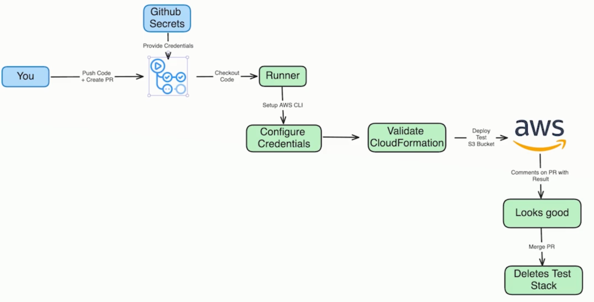

# Pipeline execution on Pull Request

This Github actions example performs 2 actions according to different situations.

1. When a pull request is created and the CloudFormation template `stack.yaml` is modified in the code, it will validate the stack and then deploy it.

2. When the PR is approved and merged, it will delete the stack deployed in the previous step.

## Diagram:

## Requirements

Set secrets variables:

-   `AWS_ACCESS_KEY_ID`
-   `AWS_SECRET_ACCESS_KEY`
